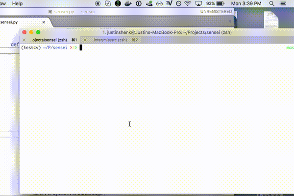
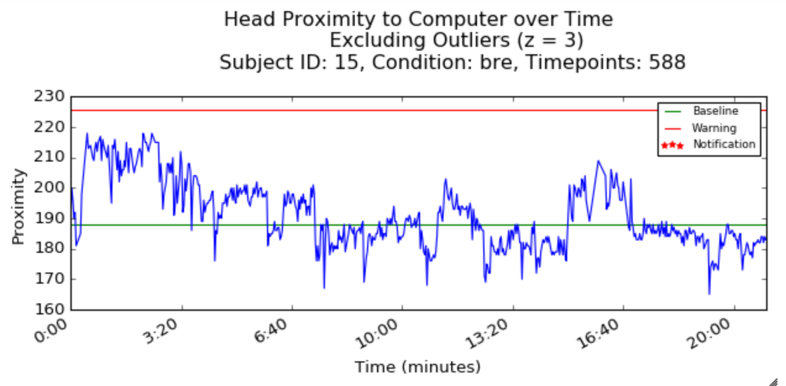

# Sensei - *(SEN-say)*🙇👊

End-to-end posture monitor and notification software, for experimentation or self-monitoring, with data analysis scripts.

## Installation via [Homebrew](https://github.com/Homebrew/homebrew)

NOTE: Requires Mac with terminal-notifier installed, PyQt5 and OpenCV.

```$ brew install terminal-notifier pyqt5 opencv3 --with-contrib --with-python3 --HEAD```

Clone the repository and run it

```$ python sensei.py```

## Demo



## Usage

Sit in comfortable, upright position
Click 'Calibrate'

You will receive notifications if you are too close.

## Analyze Your Data

Preprocess and visualize your data using the [notebook](Analyze_Data.ipynb).



## Contributing

1. Fork it!
2. Create your feature branch: `git checkout -b my-new-feature`
3. Commit your changes: `git commit -am 'Add some feature'`
4. Push to the branch: `git push origin my-new-feature`
5. Submit a pull request :D
